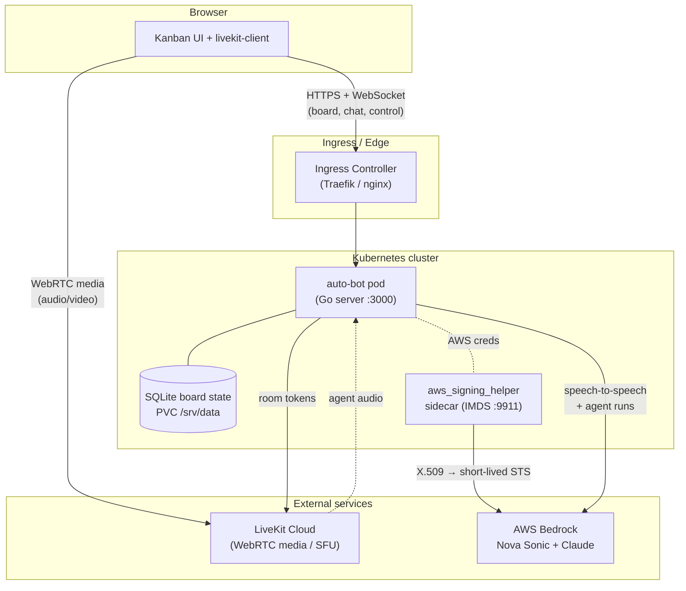

# Living Kanban Board

[](LICENSE)


A **voice-operated Kanban board where standup happens by voice.** An AI scrum-master agent
listens to the meeting, tracks who's speaking, and updates the board in real time — creating,
moving, opening, and closing tickets hands-free. Participants join with mic and webcam, see and
hear each other, and all interact with the same shared board and agent.


---

## Architecture



**How it fits together:**

- The **browser** loads the Kanban UI and connects two ways: HTTPS/WebSocket to the app for board
  state and control, and **WebRTC directly to LiveKit Cloud** for audio/video media.
- The **app pod** mints LiveKit room tokens, holds board state in a local **SQLite** file (on a
  persistent volume), and drives the AI agent.
- The agent talks to **AWS Bedrock** — Nova Sonic for speech-to-speech, Claude for board reasoning.
- AWS is reached with **no long-lived keys**: an [IAM Roles Anywhere](https://docs.aws.amazon.com/rolesanywhere/)
  sidecar exchanges an X.509 client cert for short-lived STS credentials.

You bring your own ingress (any controller), put whatever access control you like in front of it
(SSO, a private network, a tunnel), and the app stays the same.

---

## Quickstart — deploy to Kubernetes

> Prerequisites: a Kubernetes cluster (k3s, kind, EKS, …), `kubectl`, `helm`, a
> [LiveKit Cloud](https://cloud.livekit.io) project, and an AWS account with Bedrock access in
> **us-east-1** or **us-west-2** (Nova Sonic is **not** in us-east-2).

### 1. Create the app Secret

```bash
kubectl create secret generic auto-bot-secrets \
  --from-literal=APP_API_TOKEN="$(openssl rand -hex 32)" \
  --from-literal=LIVEKIT_URL="wss://your-project.livekit.cloud" \
  --from-literal=LIVEKIT_API_KEY="..." \
  --from-literal=LIVEKIT_API_SECRET="..." \
  --from-literal=LIVEKIT_BROWSER_URL="wss://your-project.livekit.cloud"
```

The container image is published — you don't need to build it. The chart defaults to
[`ghcr.io/somoore/auto-bot`](https://github.com/somoore/auto-bot/pkgs/container/auto-bot)
(signed with cosign; see [docs/deployment.md](docs/deployment.md#verifying-the-published-image)).

**Supported platforms:** `linux/amd64` and `linux/arm64` (from `v0.0.3-prealpha` on) — Intel/AMD
servers and ARM (Apple Silicon, AWS Graviton, Raspberry Pi). Per-tag arches are listed on the
[GHCR package page](https://github.com/somoore/auto-bot/pkgs/container/auto-bot); see
[releases](https://github.com/somoore/auto-bot/releases) for the latest.

For GitOps, seal this with [Sealed Secrets](https://github.com/bitnami-labs/sealed-secrets)
or [External Secrets](https://external-secrets.io) instead. See
[`deploy/helm/auto-bot/secret.example.yaml`](deploy/helm/auto-bot/secret.example.yaml).

### 2. Set up Bedrock access (IAM Roles Anywhere)

> **Heads up:** the credential-helper **sidecar image is not published** — you build it
> yourself (a few lines; see [docs/deployment.md](docs/deployment.md#2-build-the-sidecar-image))
> and point `awsRolesAnywhere.image` at your own registry. The main app image *is* published.

```bash
cd deploy/terraform/roles-anywhere
./gen-certs.sh                      # creates certs/ca.crt, certs/leaf.crt, certs/leaf.key
cp terraform.tfvars.example terraform.tfvars   # fill in agent_model_arns for your region
terraform init && terraform apply   # prints trustAnchorArn / profileArn / roleArn

# store the leaf cert the sidecar will use:
kubectl create secret generic auto-bot-ra-cert \
  --from-file=leaf.crt=certs/leaf.crt --from-file=leaf.key=certs/leaf.key
```

### 3. Install the chart

```bash
helm install auto-bot deploy/helm/auto-bot \
  --set ingress.host=auto-bot.example.com \
  --set ingress.className=traefik \
  --set awsRolesAnywhere.enabled=true \
  --set awsRolesAnywhere.trustAnchorArn=<from terraform> \
  --set awsRolesAnywhere.profileArn=<from terraform> \
  --set awsRolesAnywhere.roleArn=<from terraform>
```

Or copy [`values-example.yaml`](deploy/helm/auto-bot/values-example.yaml), edit it, and
`helm install auto-bot deploy/helm/auto-bot -f my-values.yaml`.

### 4. Open it

Visit `https://auto-bot.example.com`, start a meeting, and talk to your board.

📖 **Full guide:** [docs/deployment.md](docs/deployment.md) — ingress patterns, TLS, access
control, the no-popup auth trick, and troubleshooting.

---

## Run locally (Docker Compose)

```bash
cp .env.example .env     # fill in APP_API_TOKEN, LiveKit, AWS
make up                  # docker compose up --build -d
# open http://localhost:3001
make logs                # tail app + livekit
make down
```

---

## Voice provider

| Provider | Media path | Models | AWS needed |
|---|---|---|---|
| **AWS Nova Sonic** | LiveKit Cloud SFU | Bedrock Nova Sonic + Claude | Yes (Bedrock) |

The voice path is AWS Nova Sonic over LiveKit Cloud, with Bedrock Claude for board
reasoning and agent runs. `VOICE_PROVIDER` defaults to `nova-sonic`.

## Configuration

All settings are environment variables, surfaced through the Helm chart's `config` (non-secret)
and `secretEnvKeys` (from your Secret). Key ones:

| Var | Purpose |
|---|---|
| `APP_API_TOKEN` | App login token (required) |
| `VOICE_PROVIDER` | `nova-sonic` (default) |
| `LIVEKIT_URL` / `LIVEKIT_API_KEY` / `LIVEKIT_API_SECRET` | LiveKit Cloud (nova-sonic) |
| `AWS_REGION` | Bedrock region (us-east-1 / us-west-2) |
| `BOARD_SQLITE_PATH` | Board persistence (`/srv/data/board.sqlite`) |
| `GITHUB_*` / `JIRA_*` | Optional integrations |

See [`.env.example`](.env.example) and [`deploy/helm/auto-bot/values.yaml`](deploy/helm/auto-bot/values.yaml)
for the full list.

---

## Project layout

```
cmd/server/        Go HTTP server + agent runtime
internal/core/     stable extension contract (providers, connectors, ledger)
web/               browser UI
deploy/helm/       Helm chart
deploy/terraform/  IAM Roles Anywhere module (Bedrock auth)
docs/              architecture, deployment, contracts, threat model
```

## Extending

The stable contract package is `internal/core`; runtime implementations live outside it, and
`scripts/check-import-boundaries.sh` keeps provider-specific code out of the contract surface.

- [docs/architecture.md](docs/architecture.md) — runtime boundaries
- [docs/codebase-map.md](docs/codebase-map.md) — source → responsibility map
- [docs/extension-contracts.md](docs/extension-contracts.md) — voice/connector/model/ledger contracts
- [docs/api/openapi.yaml](docs/api/openapi.yaml) — HTTP control plane

## Security

Browser control APIs are protected by an HttpOnly session cookie; the page never receives
`APP_API_TOKEN`. For multi-user/public use, put SSO in front of the ingress: the app natively
derives a distinct per-user identity from a verified email via **Cloudflare Access** or **AWS ALB
OIDC** (see [docs/deployment.md](docs/deployment.md#access-control)). See [security.md](security.md)
and [docs/threat-model.md](docs/threat-model.md).

## Contributing

See [contributing.md](contributing.md) and [code_of_conduct.md](code_of_conduct.md).

## License

[MIT](LICENSE)
