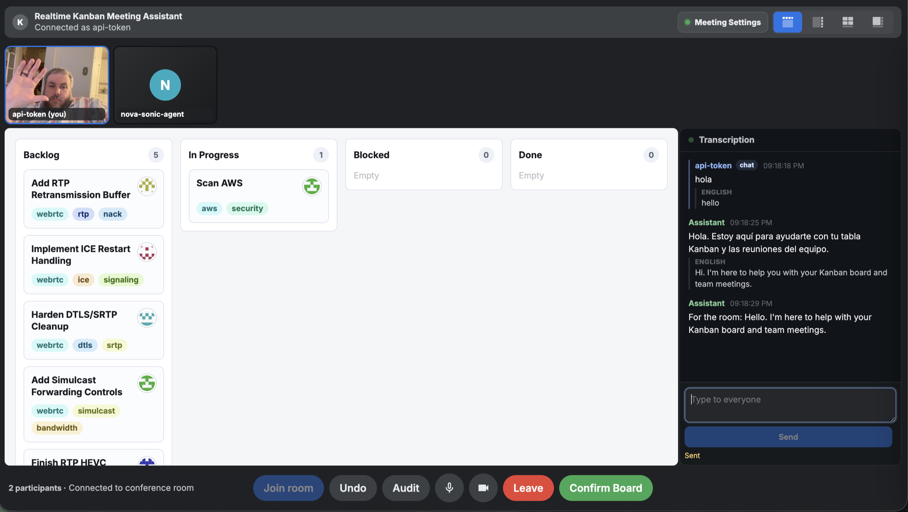

# auto-bot

[](LICENSE)
[](https://github.com/somoore/auto-bot/actions/workflows/ci.yml)


**The kanban where agents do work.** auto-bot is the agent-native work surface: a board where humans and agents are assigned the same cards, communicate through the same threads, and ship through the same audit log. Voice meetings get the board onto your team; the agent-native kanban is the product.

Category: **agent-native work surface.** Not a kanban (the Run object and projection layer outrun a kanban's schema), not an AI meeting tool (the meeting is one wedge in), not a coding-agent surface (Cursor is one MCP client we host, not a substitute). The bet: **work assignment is the right primitive for agent coordination**, and no current board treats agents as first-class assignees with durable Runs, ask-the-human threads, and outbound projections to Jira / Linear / GitHub Issues.



## What it does in 60 seconds

- **Voice standup writes the board.** Speak in the LiveKit room; cards move, comments append, follow-up cards get created. The Nova Sonic scrum-master agent receives a pre-meeting agenda assembled from the live board state (`internal/standup/agenda.go`) and the closer (`internal/standup/closer.go`) drops follow-ups when the meeting ends.
- **Agents pick up cards and pause for input.** A Run is a durable, checkpointed unit of agent work bound to a card (`internal/agent/run.go`, `agent_runs` + `run_checkpoints` SQLite tables). When the agent needs a decision it writes a `RunQuestion` (`run_questions` table); the React card drawer surfaces it with suggested-answer chips; answering resumes the run on the same checkpoint.
- **MCP-driven coding agents update their own cards.** Claude Code / Cursor / `claude-agent-sdk` connect to `cmd/mcpd` and call `board.list_cards`, `card.create`, `card.comment`, etc. Every call HTTP-dispatches through `cmd/server`'s `/internal/tools/dispatch` route so the ActionLedger, risk gate, and trust ceremony apply identically to voice, UI, and MCP callers.

## Architecture at a glance

```
                +---------+      +-------------------+    +---------+
  Browser  ---> | /app/   |      | cmd/server        |--> | SQLite  |
  React          (Vite)  ----->  | HTTP + WS + static|    | (board_ |
                                 | LiveKit token     |    |  events,|
                                 | Nova Sonic bridge |    |  agent_ |
                                 +---------+---------+    |  runs,  |
                                           |              |  run_   |
   Voice room <-- LiveKit <----------------+              |  question
                                           |              |  s, ...) |
                                           |              +---------+
                                           v
                +---------+   HTTP   +-------------------+
  Claude Code,  | cmd/    | -------> | /internal/tools/  |
  Cursor,    -> | mcpd    |          | dispatch          |
  SDK clients   | (MCP)   |          +-------------------+
                +---------+
```

| Package                                | Role                                                                          |
| -------------------------------------- | ----------------------------------------------------------------------------- |
| `internal/board`                       | Canonical card model. `Actor` discriminates `human` vs `agent` assignees.     |
| `internal/agent`                       | `Run`, `RunQuestion`, `RunCoordinator` + `RunStore` interfaces.               |
| `internal/projection`                  | Outbound projection contract (canonical board to Jira/Linear/GH Issues).      |
| `internal/projection/jira`             | Jira projection — canonical example, contract-tested.                         |
| `internal/standup`                     | Pre-meeting agenda builder + post-meeting closer.                             |
| `internal/intake`                      | Async intake parser + Slack adapter; folds into the next standup.             |
| `internal/mcp`                         | MCP server core, `BoardClient` interface, `HTTPBoardClient` dispatcher.       |
| `internal/meetings`                    | Voice meeting domain types.                                                   |
| `internal/core`                        | Stable extension contracts: `Connector`, `VoiceProvider`, `ModelProvider`, `ActionLedger`. |
| `internal/core/contracttest`           | Shared contract-test helpers.                                                 |
| `internal/projection/contracttest`     | Projection contract harness.                                                  |
| `internal/mocks`                       | Credential-free fakes for tests and the MCP smoke binary.                     |
| `cmd/server`                           | Single application binary: HTTP, WebSocket, LiveKit, Nova Sonic, board store, dispatch. |
| `cmd/mcpd`                             | MCP daemon; stdio + HTTP transports; dispatches through `cmd/server`.         |

Full system tour: [docs/architecture.md](docs/architecture.md).

## Quickstart

```bash
git clone https://github.com/somoore/auto-bot
cd auto-bot
APP_API_TOKEN=dev MCPD_TOKEN=dev docker compose up -d
# wait ~15 seconds for the Go server to come up
open http://localhost:3001/app/
```

That gets you the React board on `http://localhost:3001/app/`, the MCP HTTP transport on `http://localhost:4000`, and a LiveKit dev server on `7880`. To put real cards onto the board, see [docs/golden-demo.md](docs/golden-demo.md) for a stack with Jira sync, Bedrock voice, and a GitHub App.

For the maintainer Keychain-driven local stack (assume role, Jira token, AWS credentials, Nova Sonic), use `scripts/local-up.sh`. The local launcher is documented in [CONTRIBUTING.md](CONTRIBUTING.md); it is not the open-source quickstart.

Health and observability:

```bash
curl -s http://localhost:3001/healthz
curl -s -H "Authorization: Bearer dev" http://localhost:3001/workspace/status
curl -s -H "Authorization: Bearer dev" http://localhost:3001/observability/status
```

## MCP integration

Point any MCP client at the running mcpd. The HTTP transport requires a bearer token; the stdio transport is unauthenticated and assumes the parent process tree is the perimeter (see [docs/api/mcp-tools.md](docs/api/mcp-tools.md#authentication)).

Claude Code (`~/.claude/mcp.json`):

```json
{
  "mcpServers": {
    "auto-bot": {
      "transport": "http",
      "url": "http://localhost:4000",
      "headers": { "Authorization": "Bearer dev" }
    }
  }
}
```

Cursor (`.cursor/mcp.json` or settings UI):

```json
{
  "mcpServers": {
    "auto-bot": {
      "url": "http://localhost:4000",
      "headers": { "Authorization": "Bearer dev" }
    }
  }
}
```

Tool surface today (Sprint 2.0 — see [docs/api/mcp-tools.md](docs/api/mcp-tools.md) for full JSON-RPC schemas):

| Tool                | Risk   | Purpose                                                  |
| ------------------- | ------ | -------------------------------------------------------- |
| `board.list_cards`  | Low    | List cards on the active board, optionally filtered.     |
| `board.get_card`    | Low    | Fetch one card with thread + active-run summary.         |
| `card.create`       | Medium | Create a card (routed through the same gates as voice).  |
| `card.update`       | Medium | Patch one card (status, title, notes, assignee, tags).   |
| `card.comment`      | Low    | Append to a card's thread.                               |

Sprint 2.1 adds `run.start` / `run.checkpoint` / `run.ask_human` / `run.complete`. The schemas are reserved in [docs/api/mcp-tools.md](docs/api/mcp-tools.md#coming-next-sprint-21); the server-side dispatch routes are not yet wired (see [Project status](#project-status)).

## What's in the box

- **Voice meeting room.** Nova Sonic (Bedrock bidirectional speech-to-speech, primary) and OpenAI Realtime (developer fallback) share one `KanbanToolDefs()` surface (`cmd/server/board.go`). LiveKit is the SFU; the Go server bridges audio to Bedrock and back. Pre-meeting agenda injects via Nova Sonic's `sendInitSequence` (`cmd/server/nova_sonic.go:511`, `cmd/server/nova_sonic_agenda.go`).
- **Web board.** React + Vite, served at `/app/`. Observatory Deck dark palette. WebSocket-driven (`web/app/src/lib/useBoardSocket.ts`). Cards open a drawer with **Thread / Run / History** tabs; Run questions render inline with suggested-answer chips (`web/app/src/components/CardDrawer.tsx`, `CardRunTab.tsx`, `SuggestedAnswerChip.tsx`).
- **MCP server.** `cmd/mcpd` ships stdio and HTTP transports against the same `BoardClient` interface. Production injects `HTTPBoardClient` (`internal/mcp/tools.go:416-700`), which posts every mutation to `cmd/server`'s `/internal/tools/dispatch` route (`cmd/server/internal_dispatch.go`).
- **Async intake.** `POST /intake/standup` accepts written standups from a form or any HTTP client (`cmd/server/intake_handler.go`); `POST /intake/slack` accepts Slack webhook posts with HMAC signature verification (`cmd/server/intake_slack.go`). Both fold into the next agenda via `internal/intake` + `internal/standup`.
- **Jira projection.** `internal/projection/jira` is the canonical implementation of the projection contract — outbound writes, inbound reconcile, conflict resolution, contract-tested.
- **React intake form.** `web/app/src/components/IntakeForm.tsx` — async teams submit a written standup without joining the voice room.

## Extending it

The four contracts in `internal/core` and `internal/projection` are the entire extension surface:

| Extending                  | Implement                          | Reference example                                                            |
| -------------------------- | ---------------------------------- | ---------------------------------------------------------------------------- |
| A new external system      | `projection.Projection`            | `internal/projection/jira/projection.go`                                     |
| A new voice provider       | `core.VoiceProvider`               | `examples/voice-provider-template/`                                          |
| A new model provider       | `core.ModelProvider`               | `examples/model-provider-template/`                                          |
| A new write-side connector | `core.Connector`                   | `examples/connector-template/`                                               |
| A new MCP tool             | Register in `internal/mcp/tools.go`| The five existing tools.                                                     |

All contracts ship with contract-test harnesses (`internal/core/contracttest`, `internal/projection/contracttest`) so a new implementation can prove it meets the semantics before it's wired into the runtime.

## Trust and safety

The product is opinionated about not lying to humans about what was done to their systems:

- **Dry-run staging.** Medium- and high-risk mutations land in `pending_actions` first; the UI shows a diff preview before they commit (`cmd/server/pending_actions.go`, `cmd/server/diff_preview.go`, `web/app/src/components/DryRunQueue.tsx`).
- **Undo.** Every mutation routes through `core.Connector.Undo`; the Card drawer's history tab surfaces an undo button on the most recent change.
- **Pause-all kill switch.** A per-tenant `tenant_settings.agents_paused` flag rejects new Run starts with `agent.ErrAgentsPaused` (`internal/agent/store.go:34`); the pill is a visible UI control (`web/app/src/components/PauseAllPill.tsx`).
- **ActionLedger audit.** Voice / UI / MCP mutations all record `ActionIntent` to `ToolCallRecord` to `ExternalConfirmation` in the same ledger (`internal/core/ledger.go`); `action_replay_events` persists this in SQLite for restart-survivable replay.

Architectural rationale: [docs/adrs/0001-core-extension-boundaries.md](docs/adrs/0001-core-extension-boundaries.md), [0002](docs/adrs/0002-canonical-board-with-external-projections.md), [0003](docs/adrs/0003-mcp-server-as-universal-external-surface.md), [0004](docs/adrs/0004-multi-tenant-model.md).

## Project status

Working from the program plan [`i-would-like-you-enchanted-firefly.md`](docs/planning/plan.md). Live branch: `agent-first-v2-sprint-0`.

- [x] **Sprint 0** — Monolith breakup (`internal/{board,agent,projection,intake,standup,mcp,core,…}`), tenant scoping threaded end to end, SQLite schema migrated to composite `(tenant_id, board_id)` keys.
- [x] **Sprint 1** — Agents as first-class Actors; durable Run object with checkpoints, plan, cost, waiting-on; ask-the-human loop with `RunQuestion` lifecycle.
- [x] **Sprint 2.0** — MCP server `cmd/mcpd` with five board tools dispatching through `/internal/tools/dispatch`.
- [x] **Sprint 3.0** — Canonical board + projection contract; Jira rewritten as `internal/projection/jira`.
- [x] **Sprint 4.0** — Trust ceremony: dry-run queue, diff preview, undo, pause-all.
- [x] **Sprint 4.1** — Closed-loop standup: pre-meeting agenda injection, post-meeting closer creates follow-up cards and kicks Runs.
- [x] **F1.0 / F1.1** — React board with card drawer, Run tab, suggested-answer chips, dry-run queue, pause-all pill.
- [x] **Async intake** — `/intake/standup` and `/intake/slack` (Daria persona's #1 finding).
- [ ] **Sprint 2.1** — MCP `run.start` / `run.checkpoint` / `run.ask_human` / `run.complete` tools. JSON-RPC schemas are documented in [`docs/api/mcp-tools.md`](docs/api/mcp-tools.md); the server-side dispatch routes (F1.2) still need to be wired in `cmd/server/internal_dispatch.go`.
- [ ] **Sprint 3.1** — Linear and GitHub Issues projections.
- [ ] **Sprint 5** — Cost meter (the data model is in place via `agent.CostBreakdown` and `agent_runs.cost`; it is not yet metering live calls) and hosted control plane (`cmd/control`).

A handful of Sprint 3 commits landed with title swaps during a racing-tree merge; the deliverables are correct but the messages don't all describe their diffs. See [docs/erratum-commit-title-swaps.md](docs/erratum-commit-title-swaps.md) for the mapping. We chose an erratum over a force-push rebase because the SHAs are already referenced by other artifacts.

## Contributing

Setup, contract-test workflow, and the import-boundary rules live in [CONTRIBUTING.md](CONTRIBUTING.md). A guided new-contributor walk-through is in [docs/onboarding/new-contributor.md](docs/onboarding/new-contributor.md). Pre-commit hooks (`make precommit`) gate every commit on module hygiene, dependency pins, import boundaries, tests, formatting, Docker digest pinning, CDN SRI, and secrets scanning. Do not use `--no-verify`.

## License

MIT. See [LICENSE](LICENSE).

## Authors and acknowledgements

Built by Scott Moore (`scott@moore.cloud`) and the Sprint roster — three SWEs, two security architects, two security engineers, two QA engineers, two devil's advocates, a customer tester, three product marketers, and three scribes — coordinating through this same board. The voice-meeting wedge was inspired by Granola; the agent-native positioning is the response to running ten months of standups through tools that treated agents as outside observers.

Built on AWS Bedrock (Claude Haiku / Sonnet / Opus, Nova Sonic), LiveKit, Pion WebRTC, OpenAI Realtime, and the Model Context Protocol. None of those carry the integration logic for you; they're each one box in the diagram above.
