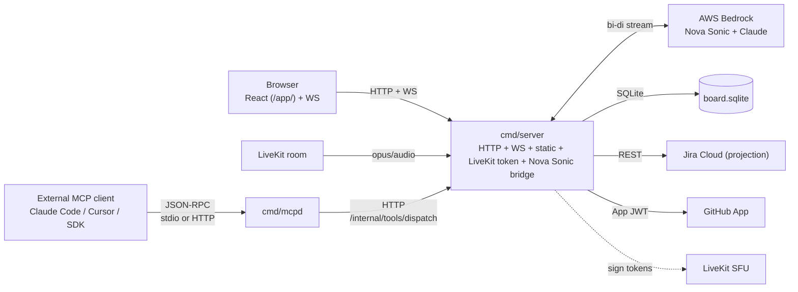

# Architecture

This document describes auto-bot as it exists on `agent-first-v2-sprint-0` (HEAD `75f737eb…`, Sprint 4 merged). For the user-facing pitch read [`../README.md`](../README.md); for the rationale behind each major decision read the ADRs under [`adrs/`](adrs/).

## 1. The thesis

The kanban is canonical. Agents are first-class Actors on it. Voice is the wedge that gets the board onto a team.

- **Canonical board.** The `internal/board.Card` struct (`internal/board/types.go:31`) is the source of truth for assignment, status, threads, evidence, and Run state. Jira, Linear, and GitHub Issues are outbound projections of that state (ADR 0002).
- **Agents as Actors.** `internal/board.Actor` discriminates `human` and `agent` kinds (`internal/board/types.go:79-97`). The same assign / comment / move primitives work for either. There is no parallel "AI" data path.
- **Durable Runs.** A Run (`internal/agent.Run`) is checkpointed agent work bound to a card. It survives restarts, pauses for `RunQuestion`, and resumes on a human answer through the same UI a human would post to (ADR 0003).
- **Voice is the wedge, not the product.** The Nova Sonic / OpenAI Realtime room mutates the same board through the same dispatch path as MCP and HTTP. A meeting is a way to populate and groom the board fast; once cards exist, agents and humans share the surface.

## 2. Topology



`cmd/server` is one binary. `cmd/mcpd` is a second binary that owns no state — every mutation it accepts is forwarded to `cmd/server` so the audit ledger, dry-run queue, and tenant settings apply uniformly.

Local Docker Compose maps `127.0.0.1:3001` to `cmd/server`, `127.0.0.1:4000` to `cmd/mcpd`, and `7880` to the LiveKit dev container (`docker-compose.yml:12-76`).

## 3. Package map

`internal/` is the stable surface. `cmd/server` is allowed to import any of it; `internal/core` imports nothing application-specific (enforced by `scripts/check-import-boundaries.sh`).

- **`internal/board`** — `Card`, `Actor`, `Comment`, `IssueLink`, status vocabulary. `Actor.UnmarshalJSON` (`internal/board/types.go:105`) accepts both the canonical agent-aware shape and the legacy Jira-User shape so old snapshots load. SE-1 F1 invariant: a `Human` Actor must carry at least one identifier.
- **`internal/agent`** — `Run`, `RunQuestion`, `Checkpoint`, `RunCoordinator` (`coordinator.go:48`), `RunStore` (`store.go:54`). Sentinel errors: `ErrRunNotFound`, `ErrRunQuestionNotFound`, `ErrRunQuestionExpired`, `ErrAgentsPaused`, `ErrCheckpointAuditFailed`.
- **`internal/meetings`** — Voice-meeting domain types (host, participant, meeting type, transcript reference).
- **`internal/projection`** — `Projection` interface (`projection.go:15`), `BoardDelta`, `Conflict`, `Resolution`. ADR 0002.
- **`internal/projection/jira`** — Canonical projection implementation. Outbound `Project`, inbound `Reconcile`, conflict resolution, contract-tested in `projection_test.go`.
- **`internal/intake`** — Async written-standup intake: `Intake` type, `parser.go`, `slack.go` HMAC verification, in-memory `Store` (`store.go:50`). Daria persona's #1 finding.
- **`internal/standup`** — `AgendaBuilder.BuildAgenda` (`agenda.go:106`) assembles the pre-meeting briefing from board state plus open RunQuestions plus recent intakes; `Closer.Close` (`closer.go:87`) walks a `MeetingArtifact` and creates follow-up cards through a `CardCreator`.
- **`internal/mcp`** — MCP server core, `BoardClient` interface, `HTTPBoardClient` production transport, `ServeStdio` / `HTTPHandler`. `tools.go` defines the five Sprint 2.0 tools and reserves the Sprint 2.1 Run-lifecycle surface.
- **`internal/core`** — Stable extension contracts: `Connector` (`types.go:118`), `VoiceProvider` (`types.go:251`), `ModelProvider`, registries, evidence + receipt types. The audit substrate is `boardEventRecord` writing the `action_replay_events` SQLite table in `cmd/server/board_store.go` — not a core interface.
- **`internal/core/contracttest`** and **`internal/projection/contracttest`** — Shared harnesses that any new implementation must pass.
- **`internal/auth`** — Identity context; every authenticated subject carries `TenantID`. ADR 0004.
- **`internal/tenant`** — Documentation package today; will own the per-tenant SQLite / Secrets-Manager router under Sprint 5's hosted control plane.
- **`internal/mocks`** — Credential-free fakes of `BoardClient`, `Connector`, `RunStore`, `ModelProvider`, `VoiceProvider`. Used by `cmd/mcpd`'s smoke binary and by every contract test.

## 4. Contracts

The five interfaces below are the entire extension surface. Implementations live outside their defining packages.

### `core.Connector` (`internal/core/types.go:118`)

External write-side systems (Jira, GitHub, Slack, future Linear/Asana) implement `Connector`. The notable method is `Undo`, which any new connector must implement so the trust-ceremony UI can offer a reversible action.

### `core.VoiceProvider` (`internal/core/types.go:251`)

Full-duplex speech systems implement `VoiceProvider`. `Session.SendEvent` and the `VoiceSessionEvent` channel are the bidirectional surface. Nova Sonic, OpenAI Realtime, and any future Bedrock or LiveKit-cloud-backed provider register through `core.VoiceRegistry`.

### `core.ModelProvider`

Agent-orchestrating model providers (today: Bedrock-Claude). No direct Anthropic API path is wired; an autonomous Run fails visibly rather than dispatching if Bedrock cannot be initialized.

### `projection.Projection` (`internal/projection/projection.go:15`)

```go
type Projection interface {
    Name() string
    Capabilities() Capabilities
    Project(ctx context.Context, delta BoardDelta) error          // outbound writes
    Reconcile(ctx context.Context) ([]board.Card, error)          // inbound pull
    ResolveConflict(ctx context.Context, c Conflict) (Resolution, error)
    Health(ctx context.Context) Health
}
```

`BoardDelta` carries `TenantID`, `BoardID`, changed cards, and deleted card IDs. Conflict resolution returns one of `keep-local`, `keep-remote`, `merge`, or `ask-user`. Replay of yesterday's `action_replay_events` against a projection must yield the same outbound calls — that's the regression test gate for shipping a new projection.

### `agent.RunCoordinator` (`internal/agent/coordinator.go:48`)

```go
type RunCoordinator interface {
    Start(ctx, RunRequest) (Run, error)
    Checkpoint(ctx, runID string, cp RunStepCheckpoint) error
    AskHuman(ctx, runID string, q RunQuestion) (string, error)
    Resume(ctx, HumanAnswer) (Run, error)
    Cancel(ctx, runID string, reason string) error
}
```

`Cancel` is idempotent. `AskHuman` returns a ULID-typed question ID. `Resume` errors with `ErrRunQuestionExpired` if the TTL sweeper transitioned the question before the human answered.

### `agent.RunStore` (`internal/agent/store.go:54`)

Tenant-scoped persistence: `SaveRun`, `LoadRun`, `AppendRunCheckpoint`, `ListRunCheckpoints`, `SaveRunQuestion`, `LoadRunQuestion`, `ListOpenRunQuestions`, `MarkRunQuestionAnswered`, `ExpireRunQuestions`. The production implementation is `cmd/server`'s `sqliteBoardStore`; the in-memory implementation lives in `internal/mocks` for tests.

## 5. Data model

The SQLite schema is created by `cmd/server/board_store.go:127-258`. Every table is tenant-scoped through a `tenant_id TEXT NOT NULL DEFAULT 'default'` column on the primary key.

| Table                   | Purpose                                                                                  | Source                            |
| ----------------------- | ---------------------------------------------------------------------------------------- | --------------------------------- |
| `board_snapshots`       | One row per `(tenant_id, board_id)`. JSON-encoded canonical state. Sequence-numbered.   | `board_store.go:131`              |
| `board_events`          | Append-only mutation log per `(tenant_id, board_id)`. Tool name, event JSON, post-state. | `board_store.go:140`              |
| `meeting_reports`       | Post-meeting intelligence JSON keyed by `(tenant_id, board_id, meeting_id)`.            | `board_store.go:152`              |
| `agent_runs`            | Durable `Run` rows; `run_json` is the full struct.                                       | `board_store.go:162`              |
| `action_replay_events`  | Replay-quality mutation events with mutation + state JSON for projection regression.    | `board_store.go:176`              |
| `run_checkpoints`       | One-row-per-step audit of Run progression (started / completed / paused / failed).       | `board_store.go:191`              |
| `run_questions`         | RunQuestion lifecycle (open → answered / expired). TTL sweep is server-driven.          | `board_store.go:202`              |
| `tenant_settings`       | Per-tenant `dry_run_enabled`, `agents_paused`.                                          | `board_store.go:222`              |
| `pending_actions`       | Dry-run staging queue for medium/high-risk mutations; diff preview is computed from here.| `board_store.go:232`              |

The `intake_records` table referenced in the program plan does not yet exist — async intakes live in `internal/intake.MemoryStore` (`internal/intake/store.go:50`) and fold into the next agenda or get materialized as cards through `intake_followups.go`. The board store sees them only as the cards they produce. This is flagged in the known-limitations list.

Migration shape: `board_store.go:328-356` records a `user_version` 1 → 2 bump and the legacy single-tenant schemas, with the composite-key tables created via `CREATE TABLE IF NOT EXISTS`. The migration is one-shot and the legacy tables are dropped only after the snapshot copy succeeds.

## 6. Request lifecycle

### Voice tool call

1. Browser joins LiveKit room; `cmd/server` (`nova_sonic.go`) opens a bidirectional Bedrock stream and sends one SYSTEM block plus the pre-meeting agenda (`sendInitSequence`, `nova_sonic.go:511`).
2. Speech transcripts return as `VoiceSessionEvent` tool-call requests through `core.VoiceSession`.
3. Tool dispatch enters `meeting_intelligence.go`, classifies risk via `riskForTool`, and either executes immediately (Low) or enqueues a `pending_action` (Medium / High).
4. Execution writes a `boardEventRecord` to the `action_replay_events` table via `ApplyToolCallWithMeta`; the resulting `audit_event_id` is replay-survivable. The agent only speaks "Jira was updated" when `external_action_status=api_confirmed`.
5. Board mutation broadcasts on the WebSocket fanout, filtered by `(tenant_id, board_id)`.

### MCP tool call

1. Editor client invokes `tools/call` on `cmd/mcpd` via stdio or HTTP.
2. `internal/mcp` dispatches to the named tool handler (`tools.go` `buildListCardsTool` / `buildGetCardTool` / `buildCreateCardTool` / `buildUpdateCardTool` / `buildCommentTool`).
3. Mutation handlers call into `HTTPBoardClient` (`tools.go:438`), which posts to `cmd/server` at `/internal/tools/dispatch` (`internal_dispatch.go:71-77`) with `dispatcher: "mcp"`.
4. `cmd/server` runs the same audit ledger + risk gate + tenant-settings checks as the voice path.
5. Response flows back through the JSON-RPC envelope to the editor client.

### Async intake submission

1. `POST /intake/standup` (`intake_handler.go:43`) accepts a written standup (form or JSON). Caller identity is verified before any self-assignment (SecArch-002 gate).
2. `POST /intake/slack` (`intake_slack.go`) accepts Slack webhooks with HMAC signature verification.
3. `internal/intake.Store.Put` records the intake; `intake_followups.go` materializes intake content into one or more cards via the same `ApplyToolCall` path the voice agent uses.
4. The next call to `BuildAgenda` (`agenda.go:106`) folds recent intakes into the pre-meeting briefing under the "since last meeting" window.

### Dry-run approval

1. A Medium/High mutation lands in `pending_actions` (`pending_actions.go`); the WebSocket broadcasts a `pending_action` event with the diff payload from `diff_preview.go`.
2. The React `DryRunQueue` (`web/app/src/components/DryRunQueue.tsx`) renders the diff via `DiffPreview.tsx`.
3. Approve POSTs to `/tenant/pending_actions/<id>` (`main.go:251`); the handler executes the staged action through the same connector path.
4. The original `ActionIntent` is sealed by an `ExternalConfirmation` recording the post-approval result.

## 7. Audit and replay

Two layers compound:

- **`board_events`** logs the event JSON plus post-state JSON per mutation, so the audit-replay UI can show before/after diffs without re-running connector calls.
- **`action_replay_events`** is the projection-grade log: complete mutation JSON, complete state JSON, sequence-numbered per `(tenant_id, board_id)`. Every `ApplyToolCallWithMeta` writes a `boardEventRecord` here and returns an `audit_event_id` so callers can later request `replay_audit_event`. ADR 0002 calls out that "replay of yesterday's events against the new projection must yield identical Jira output" — that's the regression gate for shipping Linear and GitHub Issues projections in Sprint 3.1.

The audit log persists across restart; recent records are loaded into the in-memory cache by `cmd/server`'s startup path so audit-replay survives a `docker compose restart`.

## 8. Trust ceremony

`tenant_settings.dry_run_enabled` and `tenant_settings.agents_paused` (`cmd/server/tenant_settings.go:17`) are the two per-tenant switches.

- **Dry-run.** When enabled (`board.go:335`), medium/high-risk mutations stage into `pending_actions` instead of writing. The diff preview is computed by `diff_preview.go` from the prospective post-state vs current state.
- **Undo.** The React Card drawer's history tab calls `DELETE /tenant/mutations/<id>` (`main.go:253`), which invokes the originating `core.Connector.Undo`. Connectors that cannot undo report it through their `Capabilities`.
- **Pause-all.** `tenant_settings.agents_paused = true` makes `RunCoordinator.Start` return `agent.ErrAgentsPaused` (`internal/agent/store.go:34`) without persisting the Run. The UI button is `PauseAllPill.tsx`. Voice and MCP both observe the gate.

## 9. Closed-loop standup

The standup loop is the integration test of the whole shape:

1. **Pre-meeting.** A cron tick 15 minutes before scheduled standups (`cmd/server/cron.go`) calls `standup.AgendaBuilder.BuildAgenda(ctx, tenantID, boardID, since)`. The agenda lists highlights, blockers, open Runs needing review, and open RunQuestions. The result is stored and injected on the next voice room connect via `nova_sonic_agenda.go:32` → `sendInitSequence` (`nova_sonic.go:511`).
2. **During.** Voice tool calls mutate cards; pending confirmations queue; agents that need input write `RunQuestion`s that surface inline in the UI.
3. **Post-meeting.** `end_meeting` triggers `standup.Closer.Close(ctx, MeetingArtifact)` (`closer.go:87`). The closer iterates the artifact's `Follow-ups`, creates a card for each via `CardCreator`, and posts the meeting summary to an `ArtifactSink`. Any RunCoordinator wired to a follow-up gets `Start` called with the new card's ID.

`CloseResult.Errors` collects per-item failures; partial failure does not abort the close. ADR 0003 makes the symmetry explicit: a voice tool call, an MCP tool call, and a closer-driven card creation all walk the same dispatch path.

## 10. Tenancy

ADR 0004 governs. The current state (Sprint 0 first slice):

- `requestAuthContext.TenantID` (`cmd/server/auth.go:42`) is populated from session or bearer auth. `defaultTenantID = "default"` (`auth.go:24`) is the single-tenant fallback.
- `kanbanBoard` (`cmd/server/board.go:126`) carries `tenantID` and `boardID` and threads them into every store call.
- Every `internal/agent.RunStore` method, every `internal/projection.BoardDelta`, every `internal/intake.Store` key includes the tenant.
- Every SQLite table uses `(tenant_id, ...)` composite primary keys (section 5).
- WebSocket fanout (SA-1 fix) filters by `(tenant_id, board_id)` so an authenticated subject only sees their own board's events.

Known tenancy limitation: card-ID counters in the legacy in-memory board are per-board, not per-tenant; two tenants sharing a process can collide on synthetic IDs like `card-001`. Jira-projected cards use the Jira issue key and dodge this; pure-local boards do not. Sprint 5 (per-tenant SQLite file + control plane) closes this.

Hosted shape (Sprint 5, pending): per-tenant SQLite file via `internal/tenant/router.go`, per-tenant secrets in AWS Secrets Manager fetched through `aws_refresh.go`, `cmd/control` for tenant CRUD and LiveKit project provisioning.

## 11. Known limitations

These are real today on `agent-first-v2-sprint-0`. They are not bugs; they are honest gaps.

- **F1.2: MCP `run.*` dispatch routes not wired.** The Sprint 2.1 tool schemas are reserved in `docs/api/mcp-tools.md`, but `cmd/server/internal_dispatch.go:71-77` handles only `card.create`, `card.update`, `card.comment`. `run.start` / `run.checkpoint` / `run.ask_human` / `run.complete` need server-side handlers before the MCP tools can ship.
- **MCP `InMemoryBoardAdapter` removed.** Earlier Sprint 2.0 work used an in-process board adapter for the MCP smoke binary. Production now uses `HTTPBoardClient` (`internal/mcp/tools.go:438`) so dispatch goes through `cmd/server`'s ledger; the smoke binary uses `internal/mocks.BoardClient` instead. Any external reference to `InMemoryBoardAdapter` is stale.
- **Linear and GitHub Issues projections pending Sprint 3.1.** Only `internal/projection/jira` is implemented today. The projection contract (`internal/projection/projection.go`) is stable; the contract-test harness in `internal/projection/contracttest` is ready for them.
- **Cost meter is data-model-ready, not metering.** `agent.Run.Cost` (`agent/types.go`), `CostBreakdown`, and `agent_runs.run_json.cost` exist, but Bedrock call costs are not yet rolled up per Run in production. `AGENT_COST_BUDGET_CENTS` enforces a pre-call estimate; actual per-meeting and per-run totals are the Sprint 5 deliverable.
- **No `intake_records` SQLite table.** Async intakes live in `internal/intake.MemoryStore` and become durable only when they materialize as cards. If durability for unmatched intakes becomes a requirement, the table will land in a Sprint 3 / 4 slice.
- **Per-tenant card-ID counters.** Two tenants sharing a process can mint colliding synthetic card IDs for non-Jira boards. Closed by Sprint 5 per-tenant SQLite.
- **Hosted control plane (`cmd/control`) pending Sprint 5.** Single-tenant local installs work end-to-end today; hosted multi-tenant deployments are an explicit future deliverable.
- **OpenAPI spec is incomplete.** `docs/api/openapi.yaml` documents the voice/meeting/identity endpoints but does not yet list the Sprint 4 endpoints (`/intake/standup`, `/intake/slack`, `/tenant/pending_actions`, `/tenant/settings`, `/internal/tools/dispatch`). The routes are wired (`cmd/server/main.go:238-253`); the spec needs to catch up.

See [`erratum-commit-title-swaps.md`](erratum-commit-title-swaps.md) for the Sprint 3 commit-message race and the lost-and-recovered artifacts.
