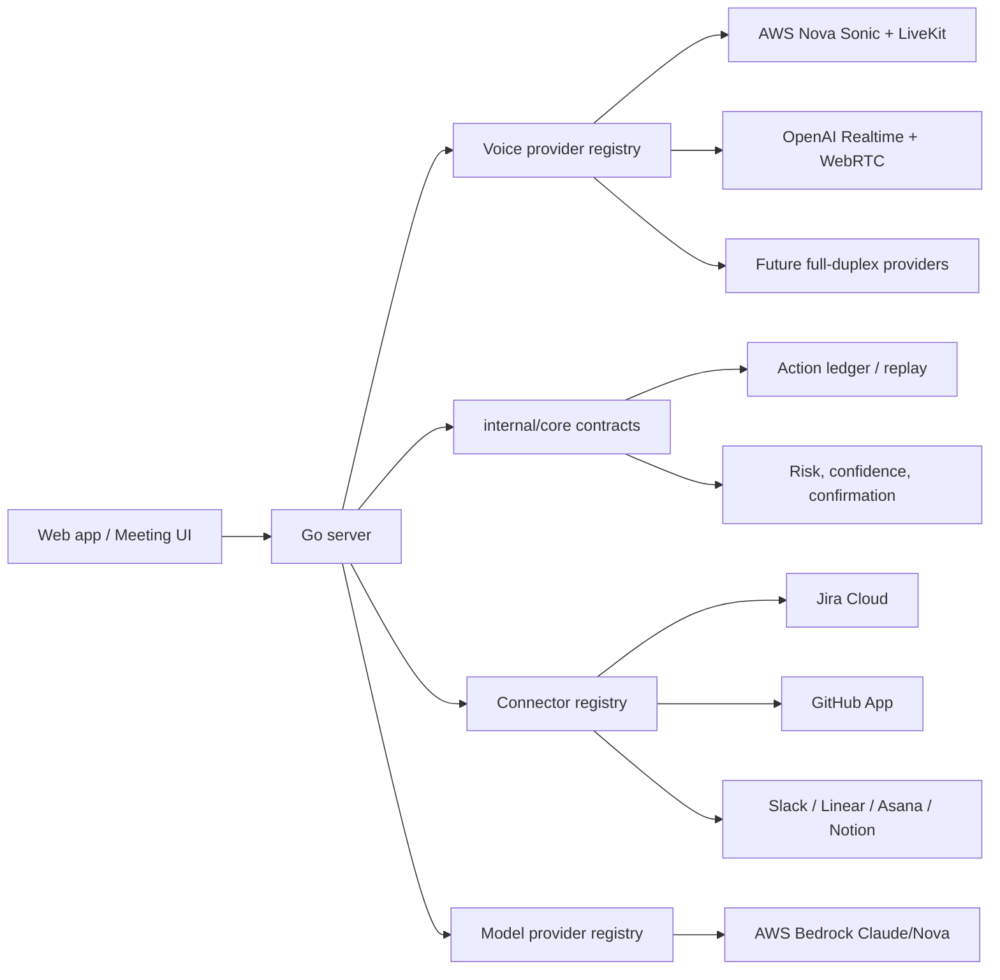
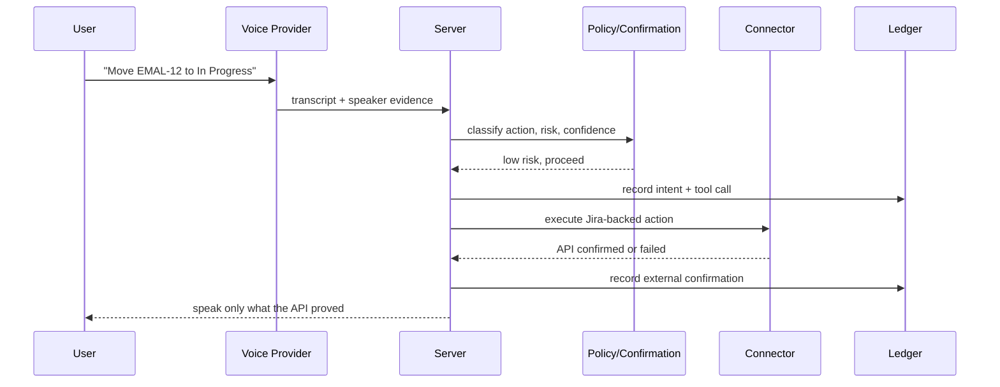

# Architecture

Auto Bot is a voice-first meeting runtime with a governed action layer. Live participants talk naturally, the scrum-master agent captures intent, and Jira/GitHub mutations execute through policy, confirmation, external API proof, and replayable audit evidence.

## System Shape



## Boundaries

`internal/core` is the stable extension surface. It defines:

- `VoiceProvider` for full-duplex speech systems.
- `Connector` for external systems such as Jira, GitHub, Slack, Linear, and Asana.
- `ModelProvider` for Bedrock-backed agent orchestration.
- `ActionLedger` for intent, tool-call, external-confirmation, and replay records.
- Contract-test helpers under `internal/core/contracttest`.

`internal/core` must not import application runtime code, Jira, GitHub, LiveKit, Bedrock, Pion, SQLite, or browser/UI packages. `scripts/check-import-boundaries.sh` enforces that.

`cmd/server` is the current application runtime. It owns HTTP, WebSocket, LiveKit token minting, Nova Sonic bridging, board state, Jira sync, GitHub App orchestration, and UI endpoints. New provider or connector implementations should adapt into `internal/core` contracts and then be registered by the server runtime.

`internal/mocks` contains no-credential implementations for tests only. Product/demo paths should use real providers and connectors.

## Action Path



The agent must not claim Jira or GitHub success unless the relevant API confirms it. Local board mutation, external API confirmation, confidence evidence, and audit replay are separate concepts.

## Extension Contracts

Voice providers implement `core.VoiceProvider`. A provider declares transport, full-duplex support, modalities, health, and session lifecycle. This is the path for Nova Sonic, OpenAI Realtime, LiveKit Cloud-backed providers, and future full-duplex speech models. Model-specific profiles matter: `gpt-realtime-2` is the OpenAI tool-calling voice-agent profile, while `gpt-realtime-whisper` and `gpt-realtime-translate` are registered as transcription/translation profiles without Jira or GitHub write authority.

Connectors implement `core.Connector`. A connector declares capabilities, health, action execution, and undo semantics. Jira and GitHub are current first-class connectors; new tools should expose capability names, risk levels, and receipts that can be replayed.

Model providers implement `core.ModelProvider`. The current runtime registers Bedrock as the model provider. Direct Anthropic API usage is intentionally not part of the agent path.

## Current Migration Status

The extension layer is in place and tested. The existing runtime still contains mature Jira, GitHub, Nova Sonic, and OpenAI paths in `cmd/server`; those are now exposed through adapter descriptors while behavior stays stable. Future refactors should move one implementation at a time behind the contracts, with contract tests and eval fixtures added before changing behavior.

The action replay ledger is persisted in SQLite when `BOARD_SQLITE_PATH` is configured. Recent replay records are loaded on restart so audit can still answer what speech/tool/API result caused a mutation after a process restart.

Workspace scaffolding is exposed through `/workspace/status`. The current runtime remains deployment-scoped to one workspace/board/room, while the data model now names the future split: workspace-scoped rooms, boards, connector installs, and secrets.

## Quality Gates

Run:

```bash
make test
make boundary
make precommit
```

The pre-commit path checks module hygiene, dependency lock files, immutable release pins, import boundaries, package graph resolution, tests, formatting, Docker image pinning, Debian package pinning, Terraform/Terragrunt formatting, CDN SRI, and optional installed scanners such as `golangci-lint`, `govulncheck`, and `gosec`.
